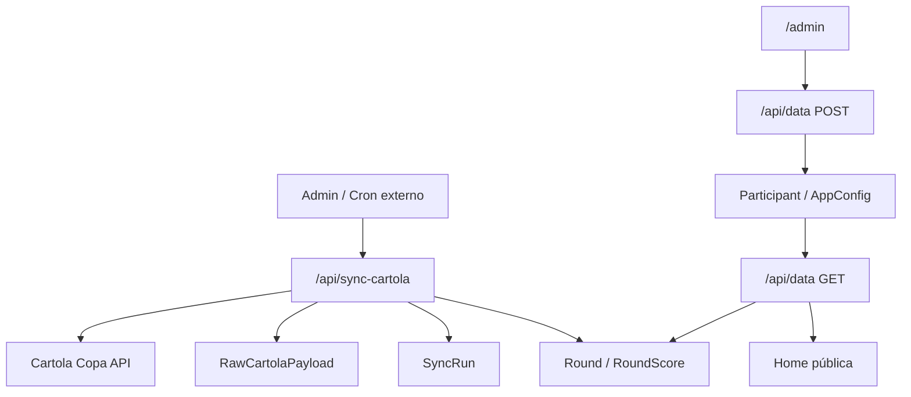

# Roadmap da Liga Rua do Comércio

Este plano transforma o sistema de ranking manual em uma plataforma de liga local com automação, histórico, resenha e operação segura.

## Estado atual implementado

| Área | Status | Observação |
|---|---:|---|
| Ranking público | Feito | Pódio, classificação geral, fonte da pontuação e variação de posição. |
| Premiação | Feito | Valor por pessoa e divisão 1º/2º/3º calculados automaticamente. |
| Admin protegido | Feito | Login por senha/JWT. |
| Participantes | Feito | Cadastro manual e vínculo com time do Cartola por ID. |
| Busca Cartola | Feito | `/api/cartola-search` consulta times no endpoint público do Cartola Copa. |
| Sincronização | Feito | `/api/sync-cartola` busca status, rodadas, partidas e pontuação dos times vinculados. |
| Banco relacional | Feito | Participantes, rodadas, pontuações, logs, payload bruto e badges. |
| Fallback manual | Feito | Pontuação manual continua funcionando quando não houver dados automáticos. |
| Logs de auditoria | Feito | `SyncRun` e `RawCartolaPayload` registram execução e resposta da API. |
| Perfil do participante | Feito | `/participant?id=...` mostra estatísticas, badges, histórico e resumo copiável. |
| Debug local | Feito | `npm run verify` valida o projeto e `npm run probe:cartola` testa endpoints públicos. |

## Automação Cartola

### Endpoints públicos viáveis

Base da Copa: `https://api.cartola.globo.com/copa`

| Endpoint | Uso | Estabilidade esperada |
|---|---|---|
| `/mercado/status` | Rodada atual, status do mercado e fechamento. | Boa, mas não documentada oficialmente para terceiros. |
| `/rodadas` | Calendário das 8 rodadas da Copa. | Boa durante a edição da Copa. |
| `/partidas` | Jogos da rodada. | Boa, mas pode variar antes/depois da rodada. |
| `/times?q=nome` | Buscar time/cartoleiro. | Boa para busca pública. |
| `/time/id/{time_id}` | Dados do time atual. | Média. Pode retornar estado vazio se o time ainda não escalou. |
| `/time/id/{time_id}/{rodada}` | Pontuação do time por rodada. | Média. Essencial para a liga, mas não documentado. |

### Provavelmente exige autenticação ou é instável

| Recurso | Risco |
|---|---|
| Dados completos de uma liga privada | Pode exigir sessão Globo/Cartola. |
| Endpoints com `/auth/liga/...` | Retornam 401 sem autenticação. |
| Ranking oficial da liga por slug | Pode não existir publicamente, mudar ou falhar. |
| Pontuação ao vivo antes do fechamento | Pode ser 204, parcial ou mudar durante os jogos. |

### Arquitetura segura

Princípios:

- O navegador público nunca chama o Cartola direto.
- O backend concentra integração, timeout, logs, cache e fallback.
- A sincronização é disparada pelo admin ou por cron externo com `CRON_SECRET`.
- O banco guarda o payload bruto para auditoria quando a API mudar.
- O ranking público usa os últimos dados válidos; se não houver sync, usa manual.

## Prioridades por fase

### MVP operacional

| Funcionalidade | Impacto | Dificuldade | Prioridade |
|---|---:|---:|---:|
| Vincular participantes a times Cartola | Alto | Baixa | P0 |
| Sincronizar rodada pelo admin | Alto | Média | P0 |
| Ranking geral automático | Alto | Média | P0 |
| Ranking da rodada | Alto | Baixa | P0 |
| Status da rodada e última sync | Médio | Baixa | P0 |
| Fallback manual | Alto | Baixa | P0 |
| Logs de erro da sync | Médio | Média | P1 |

### Versão 1.0

| Funcionalidade | Impacto | Dificuldade | Prioridade |
|---|---:|---:|---:|
| Perfil do participante | Alto | Média | Feito |
| Histórico por rodada sem gráfico | Alto | Baixa | Feito |
| Histórico por rodada com gráfico | Alto | Média | P1 |
| Badges persistentes no banco | Médio | Média | P1 |
| Resumo copiável do participante | Médio | Baixa | Feito |
| Card compartilhável da rodada | Alto | Média | P1 |
| Painel de conferência de erros | Médio | Média | Feito |
| Regulamento e premiações no site | Médio | Baixa | P1 |
| Auditoria de ajustes manuais | Médio | Média | P1 |

### Versão avançada

| Funcionalidade | Impacto | Dificuldade | Prioridade |
|---|---:|---:|---:|
| Grupos e mata-mata interno | Alto | Alta | P2 |
| Rivalidades/head-to-head | Alto | Média | P2 |
| Recap automático da rodada | Alto | Média | P2 |
| Hall da fama | Médio | Baixa | P2 |
| Bot WhatsApp/Telegram | Alto | Alta | P2 |
| Previsões e probabilidades | Médio | Alta | P3 |

## Plano de implementação

### Etapa 1: Estabilizar produção

1. Rodar `npm install`.
2. Rodar `npx vercel env pull .env`.
3. Rodar `npx prisma db push`.
4. Configurar `ADMIN_PASSWORD`, `JWT_SECRET` e `CRON_SECRET` na Vercel.
5. Entrar em `/admin`, buscar cada time no Cartola e salvar.
6. Clicar em `Sincronizar rodada` e conferir a página pública.

### Etapa 2: Operação de rodada

1. Após fechamento/atualização do Cartola, rodar sync pelo painel.
2. Conferir `Última sincronização`.
3. Se algum participante falhar, manter pontuação manual como contingência.
4. Registrar qualquer ajuste manual com motivo na próxima versão.

### Etapa 3: Histórico e perfis

1. Criar página `/participante?id=...`.
2. Exibir total, média, melhor rodada, pior rodada e evolução.
3. Persistir badges em `BadgeAward` ao final de cada sync.
4. Mostrar linha do tempo por rodada.

### Etapa 4: Compartilhamento e resenha

1. Criar endpoint/card HTML para top 3 da rodada.
2. Gerar imagem compartilhável com ranking, badge e identidade da liga.
3. Criar textos curtos de recap: maior subida, queda, mito e lanterna.
4. Publicar botão de compartilhamento no mobile.

### Etapa 5: Formato competitivo

1. Definir grupos ou confrontos diretos.
2. Criar tabelas `Group`, `Matchup` e `PlayoffMatch`.
3. Usar pontos da rodada para placar de confronto.
4. Exibir chaveamento e calendário.

## Ideias de identidade

- Nome público: `Liga Rua do Comércio`.
- Slogan curto: `A Copa é mundial, a resenha é local`.
- Troféus/badges:
  - `Líder da Rua`: 1º geral.
  - `Mito da Rodada`: maior pontuação da rodada.
  - `Arrancada`: subiu 3+ posições.
  - `Porteira Fechada`: rodada sem cair posição.
  - `Zebra da Rua`: vitória em confronto contra favorito.
  - `Lanterna Iluminada`: último colocado com humor, sem humilhar.
- Visual:
  - Placar com estética de transmissão.
  - Verde campo, dourado troféu, vidro escuro e escudos dos times.
  - Cards curtos e compartilháveis para WhatsApp.

## Riscos e mitigação

| Risco | Mitigação |
|---|---|
| API não documentada mudar | Centralizar integração em `lib/cartola.js` e manter logs brutos. |
| Endpoint retornar 204/500 antes da rodada | Não apagar dados antigos; registrar sync parcial. |
| Liga privada exigir autenticação | Sincronizar pelos IDs dos times cadastrados. |
| CORS bloquear navegador | Fazer chamadas somente pelo backend. |
| Rodada demorar a fechar | Mostrar status e última atualização, sem prometer tempo real absoluto. |
| Erro em participante específico | Sync parcial + fallback manual. |

## O que fazer primeiro

O maior valor com menor esforço é:

1. Vincular todos os participantes pelo admin.
2. Rodar a primeira sincronização manual.
3. Publicar a home com status, pódio, rodada e conquistas.
4. Só depois investir em perfil, cards compartilháveis e mata-mata.
